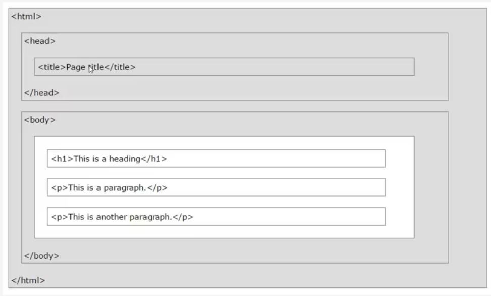
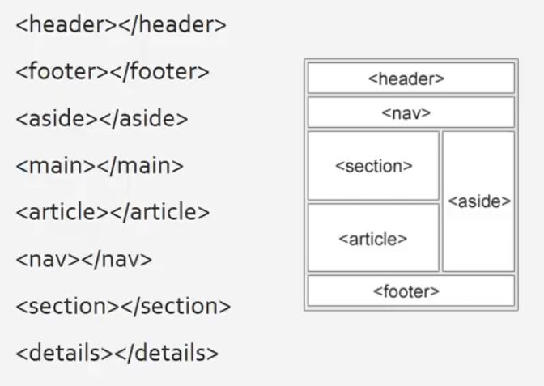

# Fundametals of HTML

## Hyper Text Markup Language

  

- HTML: Not a programming language but a markup language

- Inline elements do not start a new line and take only necessary width
  - span
  - img
  - a

- Block elements starts on new line and takes full availble width
  - div
  - h1 to h6
  - p
  - form

- HTML tag's have attributes also called properties

## Semantic Tags

  

- Semantic Tags clearly describe its meaning to browser and developer

### Index

- [Headings](src/headings.html)